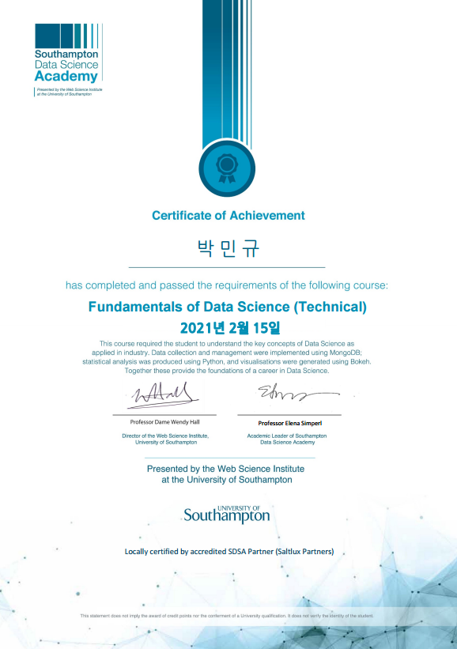
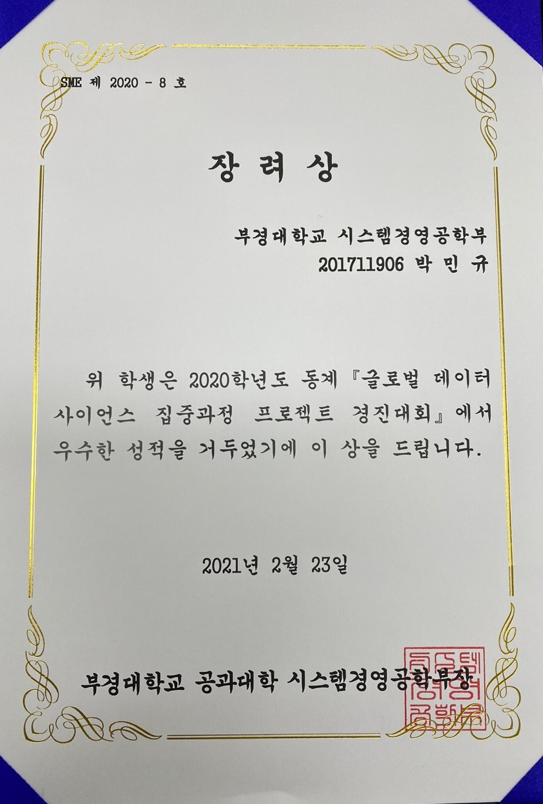

# SDSA The Southampton Data Science Academy, Fundamentals of Data Science

2021.01.05 ~ 2021.02.15

2020-동계-g-STEP 글로벌 데이터 사이언스 프로그램
* 기본적인 파이썬 테크놀로지를 학습하였습니다.
* 데이터를 수집하고 전처리하여 EDA를 하는 과정을 학습하였습니다.
* 통계학적으로 데이터를 분석하고 머신러닝을 이용하여 데이터를 학습시키는 과정을 배웠습니다.
* 데이터를 시각화하고 스토리텔링하는 과정을 학습하였습니다.

# 성과
  
  
[SDSA The Southampton Data Science Academy](https://cms.pknu.ac.kr/pknusme/view.do?no=13640&idx=483693&view=view&pageIndex=1&sv=&sw=) 
* 이론 정리, 과제수행 내역, 토론수행 내역 등 교육 과정 정리 및 데이터 사이언스 적용 연구계획으로 사회적 거리두기 조치 단계 별 코로나19 확진자 감소 효과를 주제로 성과보고서 3등 수상
* [시상식](https://cms.pknu.ac.kr/pknusme/view.do?no=13640&idx=484700&view=view#none)
* 자세한 보고서 내용은 [클릭](https://github.com/pmingyu/gStep/blob/main/SDSA%20%EB%B3%B4%EA%B3%A0%EC%84%9C(201711906_%EB%B0%95%EB%AF%BC%EA%B7%9C).pdf) 참고 바랍니다.
